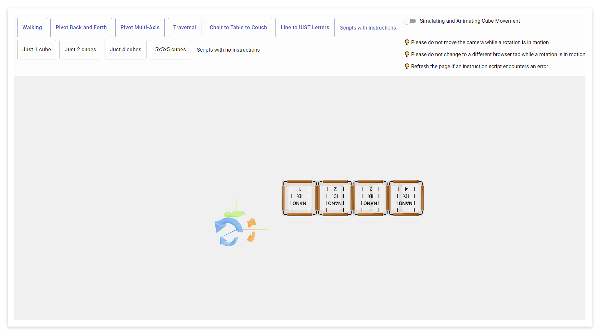

# Transformers-Visualizations

Designing and Implementing Visualizations for Permanent Magnets and Electromagnets to Demonstrate Propulsion and Attachment

## Online Demo 

Hosted on Netlify at: https://transformers-visualizations.netlify.app/

## Notable Versions
- "V2.0 react": the main project!
- "V4.0 react-bare": project without most of the react code and relying on direct hardcoding of ThreeJS code 

## Built With
- React
- TypeScript
- ThreeJS through react-three-fiber

## Screenshot
